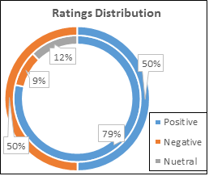

# BRAD: Books Reviews in Arabic Dataset
- [Description](#description)
- [Dataset](#dataset)
- [Citation](#citation)

## Description

This dataset contains **510,600** book reviews in Arabic language. The reviews were collected from [GoodReads.com](http://www.goodreads.com) website during June/July 2016. This work is an extension of the early dataset of large-scale Arabic dataset, [LABR](https://github.com/mohamedadaly/LABR), which has  around 63K Arabic Book Reviews collected from [GoodReads.com](http://www.goodreads.com).
The reviews are expressed mainly in Modern Standard Arabic but there are reviews in dialectal Arabic as well. 
The following table summarize some tatistics on the HARD Dataset.

| Property                  | Number  	| Property                  | Number    	|
|--------------------------	|---------	|--------------------------	|-----------	|
| Number of reviews        	| 510,598 	| Median reviews per book 	| 37       	|
| Number of users         	| 76,530   	| Min reviews per book    	| 1         	|
| Avg. reviews per user   	| 7     	| Number of books          	| 4993    	|
| Max reviews per user    	| 396	| Avg. reviews per book    	| 102	|
| Median reviews per user 	| 2     	| Number of tokens         	| 39,886,898 	|

The following figure depicts the reviews distribution in BRAD Datasets; balanced (inner) and unbalanced (outer).

You may refer to our paper, cited below, for details on the dataset.

## Dataset

- data/
                      
  - bal-reviews.csv.rar: a zipped CSV file containing the balanced dataset of positive and negative reviews. Only positive (ratings 4 & 5) and negative (ratings 1 & 2) reviews are included. The dataset consists of a little bit more than **156K** reviews. The format of each review record is:
                     
                     rating<TAB>review_id<TAB>book_id<TAB>user_id<TAB>review

  - unbal-reviews.csv.rar: the whole dataset of more than **510K** reviews. This is a *clean* dataset that includes all reviews. The format of each review record is:
                     
                     rating<TAB>review_id<TAB>book_id<TAB>user_id<TAB>review
                     
    where:
                     rating: the user rating on a scale of 1 to 5
                     review id: the id of the review (to access the review of a specific review)
                     book id: the id of the hotel
                     user id: the type of user (single, couple, ...)
                     review: the text of the review
                      
## Citation

Please cite the following paper if you decise to use the dataset:
Conference: Conference: 

    Elnagar A. and Einea O. 'BRAD 1.0: Book reviews in Arabic dataset'. 2016 IEEE/ACS 13th International Conference of 
    Computer Systems and Applications (AICCSA), pp. 1-8, Nov 2016. DOI: 10.1109/AICCSA.2016.7945800.
